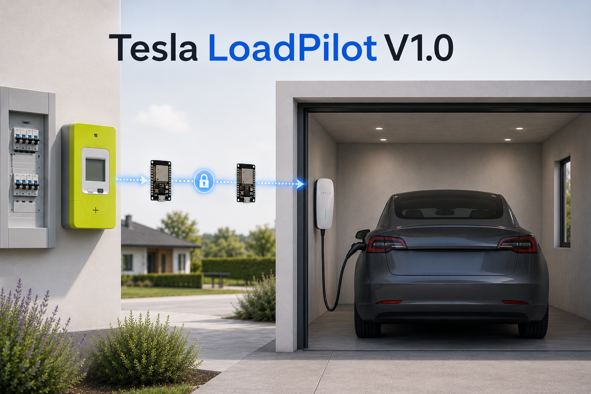
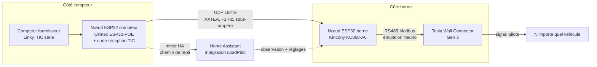

# Tesla LoadPilot

🇬🇧 [English version](README.md)

**Gestion dynamique de charge 100 % locale, sans cloud, pour le Tesla Wall Connector Gen 3, pilotée par le compteur du fournisseur.** La borne ajuste sa puissance en temps réel à ce que la maison laisse disponible, pour n'importe quel véhicule, y compris ceux de vos invités : pas d'API véhicule, pas de cloud constructeur, pas de compteur d'énergie supplémentaire à acheter.

> Statut : **bêta privée, version 0.1.0**, en production sur un unique site pilote (France, triphasé 15 kVA, ~2000 épisodes instrumentés). Non publié, pas encore installable par des tiers. Voir [RELEASE_NOTES_0.1.0.md](RELEASE_NOTES_0.1.0.md).

---

## Le problème

Une borne de recharge à domicile sur un abonnement à puissance fixe, c'est une condition de course grandeur nature : le four démarre pendant que la voiture charge à pleine intensité, et le disjoncteur d'abonné (ou le compteur communicant) coupe toute la maison. La réponse officielle s'appelle Dynamic Power Management chez Tesla : elle exige un compteur vendu par Tesla (Neurio W2 / Remote Meter, coûteux et de plus en plus verrouillé derrière des comptes installateur) et ne parle que Tesla.

Le projet est d'ailleurs né d'un problème d'implantation qui rend ce matériel officiel inutilisable : le compteur Tesla doit être relié à la borne en RS485, or sur le site d'origine la borne est loin de l'arrivée électrique, là où vit la mesure. Aucun cheminement de câble praticable, donc pas de DPM officiel. LoadPilot comble cette distance en scindant les rôles entre deux nœuds ESP32 : l'un lit le compteur à l'arrivée, l'autre émule le compteur au pied de la borne, et un lien UDP chiffré sur le réseau existant remplace le câble impossible. Les bornes dotées d'une interface de pilotage ouverte (OCPP et consorts) règlent le problème en pilotant la borne elle-même ; le TWC Gen 3, lui, n'expose aucune API de contrôle : les gestionnaires de charge existants n'ont d'autre recours que l'API cloud de chaque véhicule (Tesla Fleet et compagnie), ce qui exclut les invités et les autres marques.

LoadPilot emprunte une troisième voie : **émuler le compteur Tesla** sur le bus RS485 de la borne, et lui servir une version soigneusement mise en forme des mesures que votre compteur produit déjà. Le wall connector fait alors ce pour quoi son firmware a été conçu (moduler le signal pilote vers la voiture), mais face à la consommation réelle de la maison. Le véhicule n'entre pas dans l'équation : toute voiture qui parle J1772/Type 2 obéit, puisque c'est la borne qu'on pilote, pas la voiture.

## Ce qu'il fait

- **Délestage voiture d'abord** : quand la maison a besoin de puissance, c'est la voiture qui cède en premier, par pas d'environ 1 A, jusqu'au plancher du véhicule, avant qu'on touche au moindre appareil.
- **Reprise autonome** : quand la maison se calme, la charge remonte d'elle-même (mesuré : ~1 A toutes les 30 s).
- **À l'épreuve des invités** : fonctionne à l'identique pour n'importe quel véhicule, puisque le levier est la borne.
- **Survit à tout ce qui est au-dessus** : la boucle de régulation vit dans deux ESP32 ; Home Assistant, le WiFi et le cloud peuvent tous tomber, la régulation continue sur le chemin UDP compteur-borne, avec des replis sûrs à chaque étage.
- **Instrumenté** : une intégration Home Assistant expose, par-dessus le firmware, l'état de la régulation, la marge par phase, la pire phase, les diagnostics, les réparations et des services.

## Comment ça marche

1. Le **nœud compteur** lit le compteur du fournisseur (en France : la TIC du Linky, trames toutes les ~500 ms, résolution sous-ampère en courant calculée à partir de SINSTS/URMS) et diffuse les six grandeurs par phase en UDP chiffré. Un **chien de garde TIC** invalide tout à NAN si la liaison compteur meurt : une valeur figée ne peut jamais se faire passer pour une valeur fraîche.
2. Le **nœud borne** émule un compteur Neurio sur le bus RS485 du wall connector (la borne l'interroge toutes les ~190 ms). Il retient la source la plus fraîche (l'UDP, puis le miroir HA, puis un fail-safe, mode de repli qui déclare la pleine consommation et bloque la charge) et publie la **pire phase, symétriquement sur les trois registres CT**, mise en forme par la loi de publication ci-dessous.
3. Le **wall connector** déroule sa boucle de contrôle d'origine sur ces mesures et module la voiture.

### La loi de publication (le cœur du projet)

Comportement mesuré du firmware Gen 3 (voir [docs/en/BEHAVIOR.md](docs/en/BEHAVIOR.md) pour le modèle complet, avec ses étiquettes MESURÉ/INFÉRÉ/RAPPORTÉ) :

- sa boucle de *service* s'engage sur une fonction symétrique des trois CT rapportés, tient exactement à la limite, fait descendre la voiture au-dessus, la laisse remonter en dessous ;
- sa *protection* surveille la pire phase avec un critère intégral ;
- une couche de *vraisemblance* prend le compteur en défiance en quelques secondes dès que les valeurs rapportées deviennent impossibles (inférieures au propre tirage de la borne) ou cessent de refléter les rampes de la borne. Une fois la défiance installée, le compteur est ignoré purement et simplement, parfois pendant des heures.

La loi ne publie donc jamais une valeur morte et ne masque jamais la contribution propre de la borne :

| Régime | Valeur publiée |
|---|---|
| Sous la contrainte | La réalité décalée, telle quelle : pire phase + biais + (limite - budget). Gain 1, délai nul, corrélation parfaite par construction. |
| Au-dessus de la contrainte | limite + clamp(gain × excès, 0,1, excursion max) : une pente bornée, dont la hauteur au-dessus de la limite est elle-même le signal « redescends » mesuré. |
| À la sortie de la contrainte | Une traînée additive, qui décroît à 0,15 A/s (variante B), évite d'inviter la borne à remonter aussitôt et tue l'oscillation en cycle limite. Les deltas continuent de passer à gain 1 dans les deux sens. |
| En permanence | Un dither de ±0,05 A, y compris en fail-safe, pour que la borne ne voie jamais une mesure statique. |

Le budget vaut `limite contrat × (1 - tampon %)` : avec le tampon par défaut de 10 % sur un abonnement français 15 kVA triphasé, la pire phase maison + voiture converge vers ~19,5 A sur les 21,7 A disponibles.

### Les couches de protection, de la plus rapide au dernier recours

| Couche | Réside dans | Réaction |
|---|---|---|
| Loi de publication (la voiture cède) | nœud borne | secondes |
| Pare-feu anti-glitch (R1 : plancher à 6 A tant que le contacteur est fermé, R2 : confirmation sur deux échantillons des chutes brutales) | nœud borne | instantané |
| Escalade (une disponibilité nulle qui s'installe publie limite + 0,1, autrement dit un ordre d'arrêt) | nœud borne | 120 s |
| Interrupteur STOP (ordre d'arrêt immédiat, sans rampe) | nœud borne | immédiat |
| Levier de pause (biais), aux mains du délestage côté maison | couche HA | fenêtre d'observation de 45 s, puis ~2 min |
| Délestage des appareils, alertes, signal de surcharge du compteur (STGE) | couche HA | minutes |
| Fail-safe (aucune source de mesure saine : publier la pleine consommation, avec dither) | nœud borne | fenêtre de fraîcheur de 5 s |

## Prérequis techniques

**Matériel (nomenclature du site pilote, France) :**

| Élément | Rôle | Remarques | Liens |
|---|---|---|---|
| Tesla Wall Connector Gen 3 | La borne pilotée | Le firmware 26.18 est la référence de calibration. **Gelez ses mises à jour** (bloquez par exemple son accès WAN au niveau du routeur), voir le runbook. | [Page produit](https://www.tesla.com/wall-connector) |
| Kincony KC868-A6 | Nœud ESP32 côté borne (émulation Neurio) | Carte ESP32 avec transceiver RS485 intégré (MAX13487E, direction gérée en matériel), relais et entrées en prime. N'importe quel ESP32 associé à un transceiver type MAX485 convient aussi. | [Détails matériels](https://www.kincony.com/kc868-a6-hardware-design-details.html) - [Boutique KinCony](https://www.kincony.com/) |
| Olimex ESP32-POE | Nœud ESP32 côté compteur | Alimenté par Ethernet (PoE) à côté du compteur ; n'importe quel ESP32 avec un UART libre fait l'affaire. | [Page produit](https://www.olimex.com/Products/IoT/ESP32/ESP32-POE/open-source-hardware) |
| Carte de réception Téléinfo (TIC), design Charles Hallard | Lit la sortie TIC du Linky (bornes I1/I2) | Récepteur série opto-isolé, compatible ESP32. Vendu assemblé. | [GitHub](https://github.com/hallard/WeMos-TIC) - [Tindie](https://www.tindie.com/products/25467/) - [Lectronz](https://lectronz.com/products/wemos-tic) |
| Câblage RS485 | Du nœud borne au wall connector | Paire torsadée blindée 1,5 mm² recommandée par Tesla, 120 m maximum, drain à la terre côté tableau ; en pratique, les tronçons courts non terminés passent très bien (mesuré sur le pilote). | Note d'application Tesla, voir [docs/fr/INSTALL.md](docs/fr/INSTALL.md) |
| (Optionnel) Compteur Tesla Neurio W2 | Instrument de référence uniquement | Utile pour écouter un trafic compteur authentique ou pour un test A/B face à l'émulation. Inutile pour LoadPilot lui-même : votre compteur le remplace. | [Exemple de revendeur européen](https://www.wallboxdiscounter.com/fr/tesla-neurio-energy-meter.html) |

**Logiciel :**

- Home Assistant >= 2025.12, ESPHome >= 2025.2 (`packet_transport` chiffré).
- Les deux paquets firmware de [`esphome/packages/`](esphome/packages/) (cœur borne + un fournisseur de mesure ; la TIC France est éprouvée en production, les fournisseurs DSMR/SML/pinces ampèremétriques sont des squelettes).
- Mise en service via l'appli Tesla ou Tesla One : à partir du firmware 26.2, le menu du compteur externe est verrouillé derrière des identifiants installateur, avec un contournement documenté (compte Tesla générique, « Tesla device settings »), voir [docs/fr/INSTALL.md](docs/fr/INSTALL.md).

## Configuration

Tout ce qui concerne l'utilisateur se joue à deux endroits :

1. **Le config flow** (5 étapes) : profil pays (TIC France en premier), les noms des deux nœuds ESPHome (validés contre votre registre d'entités), les réglages électriques (nombre de phases, préréglages des abonnements français de 6 à 36 kVA ou limite par phase personnalisée, tampon de sécurité expliqué en clair : 10 % de tampon = la voiture exploite 90 % de ce que la maison laisse), les six entités miroir du chemin de repli, et un écran de confirmation qui affiche le budget calculé.
2. **Les réglages à chaud**, résidant sur le nœud borne (ils survivent aux pannes de HA et aux redémarrages, avec des valeurs par défaut sûres) :

| Réglage | Défaut | Plage sûre | Remarques |
|---|---|---|---|
| Tampon | 10 % | 0-30 % | Décale le point d'équilibre sous la limite d'abonnement. |
| Gain d'écho de la loi | 0,5 | **jamais sous ~0,5** | En dessous de ce plancher, les rampes propres de la borne se diluent dans le signal publié et la couche de vraisemblance rejette le compteur (appris à nos dépens). |
| Excursion max de la loi | 1,0 A | 0,8-1,0 A | La borne a une bande morte jusqu'à ~limite + 0,9 : plafonner plus bas coûte de l'intégrale pour rien. |
| Traînée (variante B) | 0 (inerte) | 0-2,5 A | Anti-oscillation ; à activer en connaissance de cause, la validation en boucle fermée reste à faire. |
| Biais | 0 | 0-16 A | Le levier de pause ; piloté par le délestage HA, mode manuel disponible. |
| Interrupteur STOP | off | | Ordre d'arrêt immédiat. |
| Interrupteur compteur absent | off | | Interrupteur de test : fait taire complètement le serveur Modbus (la borne retombe sur son plafond documenté de 6 A). |

3. **La table de correspondance des entités** (options, avancé) : si votre nœud borne est antérieur au paquet générique et nomme ses entités autrement, associez explicitement chacune des 21 entités suivies ; une clé peut aussi être déclarée absente. C'est ainsi que tourne le site pilote lui-même.

## Ce que le pilote nous a appris

Le vrai capital du projet, c'est le modèle de comportement mesuré du wall connector, bâti sur ~5 jours d'épisodes instrumentés et recoupé avec toutes les sources communautaires que nous avons pu trouver. Morceaux choisis :

- Le service s'engage sur la *moyenne* des phases ; la protection, elle, mord sur la *pire phase*, avec une intégrale d'environ 20 A.s au-dessus de la limite (pour des excursions >= 1 A ; sous +0,5 A la borne tolère beaucoup plus et ne fait à peu près rien).
- Cascade complète validée sans la moindre intervention, une vraie danse d'équilibre : pic de cuisson, descente continue de 16 à 12 A qui épouse la pente, pause quand quatre climatiseurs ont dépassé ce que la voiture pouvait céder, relâche automatique, reprise de session autonome, zéro cycle de contacteur.
- L'état de défiance est réel, tenace et absent de toute documentation Tesla : les portes d'entrée, les non-guérisons et le protocole de cure qui fonctionne (coupure secteur, puis des heures de signal honnête, puis un démarrage de session maison calme) sont consignés dans [docs/en/BEHAVIOR.md](docs/en/BEHAVIOR.md), section 4, traces brutes à l'appui, publiées avec nos conclusions sur le suivi de tickets du projet amont.
- Les signatures d'incident et les gestes de l'exploitant sont catalogués dans [docs/en/RUNBOOK_INCIDENTS.md](docs/en/RUNBOOK_INCIDENTS.md).

## Les limites connues, sans détour

- **Un seul site pilote, un seul firmware.** Tout est calibré contre le firmware TWC 26.18 sur une installation triphasée française. Les constantes (bande morte, intégrale, planchers) peuvent dériver au gré des mises à jour Tesla ; gelez le firmware de votre borne.
- **La couche de défiance est le risque structurel.** Notre loi est conçue pour ne jamais la déclencher, et les portes d'entrée que nous avons identifiées sont fermées (valeurs impossibles, rampes absorbées, fail-safe statique), mais Tesla durcit cette couche version après version et pourrait un jour fermer complètement le contournement de mise en service.
- **La variante B (traînée anti-oscillation) est conçue et livrée, mais inerte** : sa validation en boucle fermée est le prochain essai au calendrier. Traînée coupée, une charge domestique qui flotte pile au budget peut entretenir un cycle limite de ±2,5 A qui finit en coupure de protection.
- **HA 2026.8 ignore `suggested_object_id`** : les capteurs dérivés peuvent naître avec des identifiants traduits sur les instances non anglophones ; renommez-les une fois pour toutes dans le registre (documenté dans les notes de version ; un correctif propre est à l'étude).
- **La licence n'est pas réglée.** La loi de publication a grandi sur les fondamentaux de [PVi1/esphome-twc-control](https://github.com/PVi1/esphome-twc-control) (pas de fichier de licence) ; une discussion de licence et d'attribution est en cours avec l'auteur, et rien de dérivé n'est publié. Ce dépôt reste privé tant que ce point n'est pas tranché.
- Essais physiques restants : débranchement à chaud du chien de garde TIC, test du repli 6 A compteur absent, campagne d'installation de zéro ([docs/fr/TESTPLAN.md](docs/fr/TESTPLAN.md)).

## Plan du dépôt

| Chemin | Contenu |
|---|---|
| `custom_components/loadpilot/` | L'intégration Home Assistant (config flow, coordinateur, capteurs, réparations, services, diagnostics, EN/FR). |
| `esphome/packages/` | Le firmware générique : cœur borne (loi de publication) et fournisseurs de mesure. |
| `esphome/examples/` | Fichiers de nœud prêts à adapter (triphasé, monophasé, nœud compteur). |
| `dashboards/` | Cartes Lovelace (face utilisateur : un interrupteur + l'essentiel en direct ; face réglages). |
| `docs/en/BEHAVIOR.md` | Le modèle de comportement mesuré du TWC Gen 3. Commencez ici si c'est la science qui vous intéresse. |
| `docs/fr/INSTALL.md` | Guide d'installation complet (en français). |
| `docs/en/RUNBOOK_INCIDENTS.md` | Le manuel de l'exploitant. |
| `docs/fr/TESTPLAN.md` | Campagne de validation et critères GO/NO-GO. |
| `docs/DESIGN_*.md` | Études de conception, y compris les résultats négatifs qui ont façonné la loi. |

## Crédits

Bâti sur les épaules de [PVi1/esphome-twc-control](https://github.com/PVi1/esphome-twc-control) (doctrine de corrélation, premières briques de l'émulation Neurio) et sur le travail de rétro-ingénierie de la communauté, du forum Home Assistant aux fils TWCManager. Projet sans aucun lien avec Tesla, Inc., ni approuvé ni pris en charge par elle. À utiliser à vos risques et périls : ce projet interagit délibérément avec des équipements de protection électrique ; relisez deux fois la section des limites.
