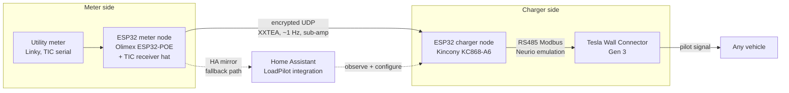

# Tesla LoadPilot

🇫🇷 [Version française](README.fr.md)

**Local, cloud-free dynamic load management for the Tesla Wall Connector Gen 3, driven by your utility meter.** The charger adapts its power to whatever the house leaves available, in real time, for any vehicle including guests' cars, with no vehicle API, no manufacturer cloud and no extra energy meter to buy.

> Status: **private beta, version 0.1.0**, running in production on a single pilot site (France, 15 kVA three-phase, ~2000 instrumented episodes). Not published, not installable by third parties yet. See [RELEASE_NOTES_0.1.0.md](RELEASE_NOTES_0.1.0.md).

---

## The problem

A home EV charger on a fixed utility contract is a race condition: the oven starts while the car charges at full amps and the main breaker (or the utility's smart meter) cuts the whole house. The official answer is Tesla's Dynamic Power Management, which requires a Tesla-sold meter (Neurio W2 / Remote Meter, expensive and increasingly gated behind installer accounts) and only speaks Tesla.

This project was actually born from a layout problem that makes the official hardware unusable: the Tesla meter must be wired to the charger over RS485, but on the original site the charger sits far away from the service entrance where the measurements live. No practical cable run, no official DPM. LoadPilot bridges that distance by splitting the roles across two ESP32 nodes: one reads the meter at the service entrance, one emulates the meter next to the charger, and an encrypted UDP link over the existing network replaces the impossible cable. Chargers with an open control interface (OCPP and friends) solve this by steering the charger itself, but the TWC Gen 3 exposes no control API at all: existing load managers can only fall back on each vehicle's cloud API (Tesla Fleet and the like), which excludes guests and other brands.

LoadPilot takes a third path: **emulate the Tesla meter** on the charger's own RS485 bus, and feed it a carefully shaped version of the measurements your utility meter already produces. The wall connector then does what its firmware was built to do (modulate the pilot signal to the car) but against your real house consumption. The vehicle is irrelevant: any car that speaks J1772/Type 2 obeys, because it is the charger being steered, not the car.

## What it does

- **Car-first load shedding**: when the house needs power, the car yields first, in ~1 A steps, down to the vehicle floor, before any appliance is touched.
- **Autonomous recovery**: when the house calms down, the charge climbs back on its own (measured: ~1 A / 30 s).
- **Guest-proof**: works identically for any vehicle, because the lever is the charger.
- **Survives everything above it**: the control loop lives in two ESP32s; Home Assistant, WiFi and the cloud can all die and the regulation keeps running on the meter-to-charger UDP path, with safe fallbacks at every stage.
- **Instrumented**: a Home Assistant integration exposes the regulation state, per-phase headroom, worst phase, diagnostics, repair issues and services on top of the firmware.

## How it works

1. The **meter node** reads the utility meter (France: Linky TIC, ~500 ms frames, sub-amp current resolution computed from SINSTS/URMS) and broadcasts the six per-phase quantities over encrypted UDP. A **TIC watchdog** invalidates everything to NAN if the meter link dies, so a frozen value can never masquerade as a fresh one.
2. The **charger node** emulates a Neurio meter on the wall connector's RS485 bus (the charger polls it every ~190 ms). It picks the freshest source (UDP, then the HA mirror, then a fail-safe that reports full consumption and blocks charging) and publishes the **worst phase, symmetrically on all three CT registers**, shaped by the publication law below.
3. The **wall connector** runs its own stock control loop against those readings and modulates the car.

### The publication law (the heart of the project)

Measured behavior of the Gen 3 firmware (see [docs/en/BEHAVIOR.md](docs/en/BEHAVIOR.md) for the full model with MEASURED/INFERRED/REPORTED labels):

- its *service* loop engages on a symmetric function of the three reported CTs, holds at exactly the limit, pulls the car down above it, lets it climb below it;
- its *protection* watches the worst phase with an integral criterion;
- a *plausibility* layer distrusts the meter within seconds if the reported values ever look impossible (below the charger's own draw) or stop echoing the charger's own ramps. Once distrusted, the meter is ignored entirely, sometimes for hours.

The law therefore never publishes a dead value and never hides the charger's own contribution:

| Regime | Published value |
|---|---|
| Below the constraint | The shifted reality itself: worst phase + bias + (limit - budget). Gain 1, zero delay, correlation is perfect by construction. |
| Above the constraint | limit + clamp(gain x excess, 0.1, max excursion): a bounded slope whose height above the limit is itself the measured "come down" signal. |
| Leaving the constraint | An additive tail decaying at 0.15 A/s (variant B) stops the charger from being invited to climb back immediately, killing the limit-cycle oscillation. Deltas still pass at gain 1 in both directions. |
| Always | A +/-0.05 A dither, including in fail-safe, so the charger never sees a static reading. |

The budget is `contract_limit x (1 - buffer%)`: with the default 10 % buffer on a French 15 kVA three-phase contract, the house-plus-car worst phase converges to ~19.5 A of the 21.7 A available.

### Protection layers, from fastest to last resort

| Layer | Lives in | Reaction |
|---|---|---|
| Publication law (car yields) | charger node | seconds |
| Anti-glitch firewall (R1 floor at 6 A while the contactor is closed, R2 two-sample confirmation of sudden drops) | charger node | instantaneous |
| Escalation (sustained zero availability publishes limit + 0.1 as a stop order) | charger node | 120 s |
| STOP switch (immediate stop order, no ramp) | charger node | immediate |
| Pause lever (bias) driven by the house-side shedding logic | HA layer | 45 s observation window, then ~2 min |
| Appliance shedding, alerts, utility-meter overload signal (STGE) | HA layer | minutes |
| Fail-safe (no healthy measurement source: report full consumption, dithered) | charger node | 5 s freshness window |

## Technical prerequisites

**Hardware (pilot bill of materials, France):**

| Part | Role | Notes | Links |
|---|---|---|---|
| Tesla Wall Connector Gen 3 | The charger being steered | Firmware 26.18 is the calibration reference. **Freeze its firmware updates** (e.g. block its WAN access at the router), see the runbook. | [Product page](https://www.tesla.com/wall-connector) |
| Kincony KC868-A6 | Charger-side ESP32 node (Neurio emulation) | ESP32 board with an onboard RS485 transceiver (MAX13487E, hardware auto-direction), relays and inputs as a bonus. Any ESP32 plus a MAX485-class transceiver works too. | [Hardware details](https://www.kincony.com/kc868-a6-hardware-design-details.html) - [KinCony store](https://www.kincony.com/) |
| Olimex ESP32-POE | Meter-side ESP32 node | Powered over Ethernet next to the meter; any ESP32 with a free UART works. | [Product page](https://www.olimex.com/Products/IoT/ESP32/ESP32-POE/open-source-hardware) |
| Teleinfo (TIC) receiver shield, Charles Hallard design | Reads the Linky's TIC output (I1/I2 terminals) | Opto-isolated serial receiver, ESP32-compatible. Sold assembled. | [GitHub](https://github.com/hallard/WeMos-TIC) - [Tindie](https://www.tindie.com/products/25467/) - [Lectronz](https://lectronz.com/products/wemos-tic) |
| RS485 wiring | Charger node to wall connector | Shielded twisted pair 1.5 mm2 recommended by Tesla, 120 m max, drain grounded panel-side; short unterminated runs are fine in practice (measured on the pilot). | Tesla app note, see [docs/fr/INSTALL.md](docs/fr/INSTALL.md) |
| (Optional) Tesla Neurio W2 meter | Reference instrument only | Useful to sniff genuine meter traffic or as an A/B test against the emulation. Not needed for LoadPilot itself: your utility meter replaces it. | [Example EU reseller](https://www.wallboxdiscounter.com/fr/tesla-neurio-energy-meter.html) |

**Software:**

- Home Assistant >= 2025.12, ESPHome >= 2025.2 (encrypted `packet_transport`).
- The two firmware packages from [`esphome/packages/`](esphome/packages/) (charger core + a meter provider; France TIC is production-proven, DSMR/SML/CT-clamp providers are skeletons).
- Commissioning through the Tesla app or Tesla One: on firmware >= 26.2 the external-meter menu is gated behind installer credentials, with a documented workaround (generic Tesla account, "Tesla device settings"), see [docs/fr/INSTALL.md](docs/fr/INSTALL.md).

## Configuration

Everything user-facing happens in two places:

1. **The config flow** (5 steps): country profile (France TIC first), the two ESPHome node names (validated against your entity registry), electrical settings (phases, contract presets for the French 6 to 36 kVA subscriptions or a custom per-phase limit, safety buffer with its plain-language meaning: 10 % buffer = the car exploits 90 % of what the house leaves), the six mirror entities for the fallback path, and a confirmation screen showing the computed budget.
2. **Runtime tunables**, resident on the charger node (they survive HA outages and reboots with safe defaults):

| Knob | Default | Safe range | Notes |
|---|---|---|---|
| Buffer | 10 % | 0-30 % | Shifts the equilibrium below the contract. |
| Law echo gain | 0.5 | **never below ~0.5** | Below that floor the charger's own ramps are diluted in the published signal and the plausibility layer rejects the meter (measured the hard way). |
| Law max excursion | 1.0 A | 0.8-1.0 A | The charger has a dead band up to ~limit + 0.9: lower caps cost integral without effect. |
| Tail (variant B) | 0 (inert) | 0-2.5 A | Anti-oscillation; enable deliberately, closed-loop validation pending. |
| Bias | 0 | 0-16 A | The pause lever; driven by the HA shedding logic, manual mode available. |
| STOP switch | off | | Immediate stop order. |
| Meter-absent switch | off | | Test switch: silences the Modbus server entirely (the charger falls back to its documented 6 A cap). |

3. **Entity mapping** (options flow, advanced): if your charger node predates the generic package and uses different entity names, map each of the 21 tracked entities explicitly; keys can also be declared absent. This is how the pilot site itself runs.

## Observations from the pilot

The project's real asset is the measured behavior model of the wall connector, assembled from ~5 days of instrumented episodes and cross-checked against every community source we could find. Highlights:

- Service engages on the phase *average*, protection bites on the *worst phase* with an integral of ~20 A.s above the limit (for excursions >= 1 A; below +0.5 A the charger tolerates far more and mostly does nothing).
- Full validated cascade, hands-off: cooking spike, continuous descent 16 to 12 A tracking the slope, pause when four ACs exceeded what the car could yield, automatic release, autonomous session resume, zero contactor cycles.
- The distrust state is real, sticky and undocumented by Tesla: entries, non-recoveries and the working recovery protocol (power-cycle plus hours of honest signal plus a calm-house session start) are all in [docs/en/BEHAVIOR.md](docs/en/BEHAVIOR.md) section 4, with raw traces published alongside our findings on the upstream project's issue tracker.
- Incident signatures and operator responses are catalogued in [docs/en/RUNBOOK_INCIDENTS.md](docs/en/RUNBOOK_INCIDENTS.md).

## Known limitations, honestly

- **One pilot site, one firmware.** Everything is calibrated against TWC fw 26.18 on a French three-phase installation. The constants (dead band, integral, floors) may drift with Tesla updates; freeze your charger's firmware.
- **The distrust layer is the structural risk.** Our law is designed to never trigger it, and the entry points we found are closed (impossible values, absorbed ramps, static fail-safe), but Tesla hardens this layer version after version and could close the commissioning workaround entirely.
- **Variant B (anti-oscillation tail) is designed and shipped but inert**: closed-loop validation is the next scheduled test. With the tail off, a house load hovering exactly at the budget can produce a +/-2.5 A limit cycle that ends in a protective cut.
- **HA 2026.8 ignores `suggested_object_id`**: derived sensors may be created with translated ids on non-English instances; rename them once in the registry (documented in the release notes; a proper fix is being investigated).
- **Licensing is not settled.** The publication law grew from the fundamentals of [PVi1/esphome-twc-control](https://github.com/PVi1/esphome-twc-control) (no license file); a licensing and attribution conversation with the author is in progress and nothing derived is published. This repo stays private until that is resolved.
- Remaining physical tests: TIC watchdog unplug test, meter-absent 6 A fallback test, from-scratch install campaign ([docs/fr/TESTPLAN.md](docs/fr/TESTPLAN.md)).

## Repository map

| Path | Content |
|---|---|
| `custom_components/loadpilot/` | The Home Assistant integration (config flow, coordinator, sensors, repairs, services, diagnostics, EN/FR). |
| `esphome/packages/` | The generic firmware: charger core (publication law) and meter providers. |
| `esphome/examples/` | Ready-to-adapt node files (three-phase, single-phase, meter node). |
| `dashboards/` | Lovelace cards (user face: one switch + live info; settings face). |
| `docs/en/BEHAVIOR.md` | The measured TWC Gen 3 behavior model. Start here if you want the science. |
| `docs/fr/INSTALL.md` | Full installation guide (French). |
| `docs/en/RUNBOOK_INCIDENTS.md` | Operator playbook. |
| `docs/fr/TESTPLAN.md` | Validation campaign and GO/NO-GO criteria. |
| `docs/DESIGN_*.md` | Design studies, including the negative results that shaped the law. |

## Credits

Built on the shoulders of [PVi1/esphome-twc-control](https://github.com/PVi1/esphome-twc-control) (correlation doctrine, Neurio emulation groundwork) and the community reverse-engineering work in the Home Assistant forum and TWCManager threads. Not affiliated with, endorsed by, or supported by Tesla, Inc. Use at your own risk: this project deliberately interacts with electrical safety equipment; read the limits section twice.
