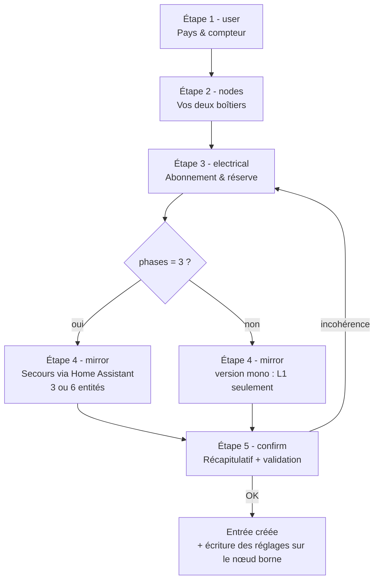
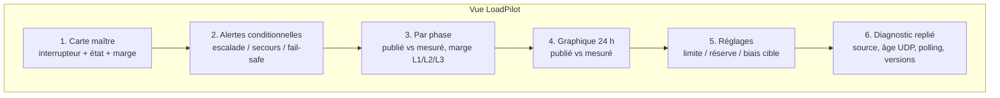

# Tesla LoadPilot - Parcours UX (design doc)

> Zone UX designer (voir /CONTRACTS.md §1.2). Document de conception interne,
> rédigé en français (le site pilote est français) ; toutes les chaînes
> destinées à l'utilisateur final existent en EN + FR dans `UX_COPY.md`,
> que le spécialiste HA intègre dans `translations/`.
>
> Principe directeur validé par l'utilisateur pilote : **une expérience à
> deux faces**. Face A = la CONFIGURATION (on la traverse une fois, elle
> doit être compréhensible par un non-expert). Face B = l'USAGE quotidien
> (un interrupteur, quelques pastilles, zéro jargon). Tout ce qui est
> technique (diagnostic, biais, escalade) existe mais est replié.

---

## 1. Personas et vocabulaire

| Persona | Ce qu'il veut | Ce qu'on lui montre |
|---|---|---|
| **Habitant** (usage quotidien) | « la voiture charge-t-elle ? est-ce que je peux allumer le four ? » | interrupteur maître, marge restante, état en langage courant |
| **Installateur / bricoleur averti** (config initiale) | brancher, configurer, vérifier | config-flow guidé avec presets, page diagnostic |
| **Contributeur** (autre pays) | adapter | mêmes écrans, profil compteur différent |

Règles de langage (appliquées dans UX_COPY.md) :

- FR : **vouvoiement**, pas de jargon - on dit « marge restante » (pas
  « headroom »), « réserve de sécurité » (pas « buffer »), « ralentissement
  volontaire » (pas « biais ») dans les textes grand public ; le terme
  technique apparaît entre parenthèses là où l'utilisateur devra le
  retrouver dans les entités.
- EN : plain English, mêmes principes (*headroom* est acceptable en EN,
  c'est un mot courant).
- Jamais « DPM », « Neurio », « Modbus » dans les écrans de config -
  réservés aux diagnostics et à la doc.

---

## 2. FACE A - Onboarding (config-flow)

### 2.0 Vue d'ensemble du flux



Cinq étapes maximum, chacune avec UNE question centrale. La validation de
cohérence est faite au fil de l'eau (erreurs de champ) ET au récapitulatif
(erreurs croisées). Clés de config : celles de `const.py` uniquement
(`country_profile`, `charger_node`, `meter_node`, `phases`,
`contract_limit_a`, `buffer_pct`, `mirror_entities`).

### 2.1 Étape 1 - `user` : pays et compteur

```
┌──────────────────────────────────────────────┐
│  Bienvenue dans Tesla LoadPilot              │
│                                              │
│  LoadPilot ajuste la charge de votre         │
│  véhicule pour que votre maison ne dépasse   │
│  jamais votre abonnement électrique.         │
│  Tout fonctionne en local, sans cloud.       │
│                                              │
│  Où est installé votre compteur ?            │
│  [ Profil compteur                      ▾ ]  │
│    ● France - Linky (TIC)        ← défaut    │
│    ○ Netherlands/Belgium - DSMR (preview)    │
│    ○ Germany/Austria - SML (preview)         │
│    ○ Universal - CT clamps (preview)         │
│                                              │
│                          [ Suivant ]         │
└──────────────────────────────────────────────┘
```

- Clé : `country_profile` (`fr_tic` | `dsmr` | `sml` | `ct_clamps`).
- Les profils non prouvés portent la mention *(preview)* et un texte
  d'avertissement honnête (squelettes firmware, pas encore validés en
  production) - on ne bloque pas, on informe.
- Le choix du profil pré-remplit l'étape 3 : `fr_tic` → presets kVA
  France ; autres profils → saisie libre en ampères.

### 2.2 Étape 2 - `nodes` : les deux boîtiers

```
┌──────────────────────────────────────────────┐
│  Vos deux boîtiers LoadPilot                 │
│                                              │
│  LoadPilot repose sur deux petits boîtiers   │
│  ESP32 déjà installés via ESPHome :          │
│  • un près de la borne (il lui parle),       │
│  • un près du compteur (il mesure).          │
│                                              │
│  Boîtier borne     [ loadpilot-twc     ▾ ]   │
│  Boîtier compteur  [ loadpilot-meter   ▾ ]   │
│                                              │
│  Astuce : si vous avez suivi le guide sans   │
│  renommer, gardez les valeurs proposées.     │
│                                              │
│              [ Retour ]  [ Suivant ]         │
└──────────────────────────────────────────────┘
```

- Clés : `charger_node`, `meter_node` - pré-remplies avec
  `loadpilot-twc` / `loadpilot-meter`.
- Idéalement des sélecteurs de devices ESPHome (filtrés) plutôt que du
  texte libre ; en cas de nœud introuvable → erreur `charger_not_found` /
  `meter_not_found` avec un texte qui renvoie au guide firmware (« le
  boîtier doit être adopté dans ESPHome et visible dans Home Assistant
  avant cette étape »).

### 2.3 Étape 3 - `electrical` : abonnement et réserve (l'écran clé)

```
┌──────────────────────────────────────────────┐
│  Votre abonnement électrique                 │
│                                              │
│  Type d'installation                         │
│   (●) Triphasé      ( ) Monophasé            │
│                                              │
│  Puissance souscrite (France)                │
│  [ 12 kVA triphasé - 20 A par phase     ▾ ]  │
│    6 kVA mono - 30 A   |  6 kVA tri - 10 A/ph│
│    9 kVA mono - 45 A   |  9 kVA tri - 15 A/ph│
│   12 kVA mono - 60 A   | 12 kVA tri - 20 A/ph│
│   15 kVA mono - 75 A   | 15 kVA tri - 25 A/ph│
│   18 kVA mono - 90 A   | 18 kVA tri - 30 A/ph│
│    ○ Autre (saisir la limite en ampères)     │
│                                              │
│  Réserve de sécurité   [ 10 ] %              │
│  Avec 10 %, la voiture n'exploite que 90 %   │
│  de votre abonnement : le reste absorbe les  │
│  à-coups (démarrage d'un four, d'une pompe)  │
│  sans faire disjoncter.                      │
│                                              │
│              [ Retour ]  [ Suivant ]         │
└──────────────────────────────────────────────┘
```

- Clés : `phases` (1|3), `contract_limit_a`, `buffer_pct` (défaut 10).
- **Presets France** (profil `fr_tic`) - le preset est une aide de saisie :
  ce qui est stocké reste `contract_limit_a` en ampères par phase.

| Puissance souscrite | Monophasé (A) | Triphasé (A par phase) |
|---|---|---|
| 6 kVA | 30 | 10 |
| 9 kVA | 45 | 15 |
| 12 kVA | 60 | 20 |
| 15 kVA | 75 | 25 |
| 18 kVA | 90 | 30 |
| 24 kVA | 120 | 40 |
| 30 kVA | - *(offre inexistante en mono, et > 120 A firmware)* | 50 |
| 36 kVA | - *(idem)* | 60 |

- Le libellé du preset montre TOUJOURS la conversion (« 12 kVA triphasé -
  20 A par phase ») : l'utilisateur apprend la grandeur qu'il retrouvera
  partout ensuite.
- « Autre » ouvre la saisie libre en ampères (profils non-FR : saisie
  libre directement, avec exemple dans le texte d'aide).
- La réserve de sécurité est un pourcentage avec l'explication en une
  phrase, TOUJOURS affichée (pas un tooltip) : c'est LE réglage que
  l'utilisateur doit comprendre.

**Validations de champ (étape 3) :**

*(aligné 17/08 sur le firmware, source de vérité : `twc-core.yaml` -
les bornes des champs SONT les bornes firmware, les erreurs dédiées
`limit_out_of_range`/`buffer_out_of_range` sont remplacées par ces bornes)*

| Règle | Erreur (clé) | Pourquoi |
|---|---|---|
| `contract_limit_a` entre 6 et 120 | - (borne du sélecteur) | enveloppe du réglage firmware (`Contract Limit` 6-120 A) ; la saisie improbable en kVA/W est rattrapée par les deux règles ci-dessous |
| `buffer_pct` entre 0 et 30 | - (borne du sélecteur) | le firmware borne ET clampe la réserve à 30 % (`Buffer Pct` 0-30) - un 0-50 côté UX n'était pas implémentable |
| `limit×(1−buffer) < 8 A` | `budget_too_small` | budget insuffisant pour démarrer une charge (~6 A min + marge) - message : « Avec ces réglages, il ne reste que X A pour toute la maison ; la voiture ne pourra jamais charger. Vérifiez la limite (en ampères PAR PHASE) et la réserve. » |
| tri + `contract_limit_a > 40` | avertissement `tri_limit_suspicious` (non bloquant : revalider sans changement confirme) | l'utilisateur a probablement saisi le total 3 phases ou la valeur mono |

### 2.4 Étape 4 - `mirror` : le secours par Home Assistant

```
┌──────────────────────────────────────────────┐
│  Secours si le lien direct est coupé         │
│                                              │
│  En temps normal, le boîtier compteur parle  │
│  directement au boîtier borne. Si ce lien    │
│  tombe, Home Assistant peut servir de relais │
│  de secours. Facultatif mais recommandé.     │
│                                              │
│  Courant phase 1  [ sensor.…_current_l1 ▾ ]  │
│  Courant phase 2  [ sensor.…_current_l2 ▾ ]  │
│  Courant phase 3  [ sensor.…_current_l3 ▾ ]  │
│  Puissance ph. 1  [ sensor.…_power_l1   ▾ ]  │
│  Puissance ph. 2  [ sensor.…_power_l2   ▾ ]  │
│  Puissance ph. 3  [ sensor.…_power_l3   ▾ ]  │
│                                              │
│  Sans relais, si le lien direct ET Home      │
│  Assistant sont indisponibles, la charge     │
│  est bloquée par sécurité (jamais de         │
│  dépassement).                               │
│                                              │
│      [ Retour ]  [ Ignorer ]  [ Suivant ]    │
└──────────────────────────────────────────────┘
```

- Clé : `mirror_entities` (×6) - pré-remplies avec les entités du nœud
  compteur (`sensor.loadpilot_meter_current_l1`…) quand elles existent.
- **Monophasé** : seuls les champs L1 sont montrés (les phases 2/3 sont
  publiées à 0 par contrat, § 2 de CONTRACTS.md).
- « Ignorer » est permis : le texte dit clairement la conséquence
  (fail-safe = charge bloquée si double panne), sans dramatiser.

### 2.5 Étape 5 - `confirm` : récapitulatif

```
┌──────────────────────────────────────────────┐
│  Vérifiez avant d'activer                    │
│                                              │
│  Compteur       France - Linky (TIC)         │
│  Installation   Triphasé                     │
│  Abonnement     12 kVA - 20 A par phase      │
│  Réserve        10 %  → budget voiture+maison│
│                 18 A par phase               │
│  Boîtiers       loadpilot-twc ✓ en ligne     │
│                 loadpilot-meter ✓ en ligne   │
│  Secours HA     configuré (6 entités)        │
│                                              │
│  Ces réglages sont écrits dans le boîtier    │
│  borne : ils restent actifs même si Home     │
│  Assistant est éteint.                       │
│                                              │
│              [ Retour ]  [ Terminer ]        │
└──────────────────────────────────────────────┘
```

- Le récapitulatif reformule TOUT en langage courant et affiche le budget
  résultant (`limit×(1−buffer)`) - c'est la vérification de cohérence que
  l'utilisateur peut faire de tête.
- La phrase « écrits dans le boîtier borne » installe le modèle mental clé
  du produit (D2 : les réglages sont résidents sur le nœud).
- À la validation : l'intégration écrit `number.loadpilot_twc_contract_limit`
  et `number.loadpilot_twc_buffer_pct` sur le nœud. **Elle ne touche PAS au
  kill-switch** : `switch.loadpilot_twc_control_enabled` reste tel quel -
  l'activation est un geste volontaire de l'utilisateur sur la carte
  (cohérent avec l'incident Mushroom : jamais d'armement implicite).

### 2.6 Options flow

Deux écrans, accessibles via « Configurer » sur l'intégration :

1. **Abonnement & réserve** - mêmes champs et mêmes validations que
   l'étape 3 (changement d'abonnement, ajustement de la réserve). Toute
   modification est réécrite sur le nœud borne.
2. **Secours Home Assistant** - mêmes champs que l'étape 4.

Pas de modification des nœuds ni du profil pays en options : ces choix
structurels passent par une reconfiguration (re-flow), c'est dit dans le
texte de l'écran.

---

## 3. FACE B - L'usage quotidien

### 3.1 La carte type (`loadpilot_card.yaml`)

Inspirée de la page « Chargeur » du site pilote (docs/fr/50_COUCHE_HA.md) :
un interrupteur, des pastilles d'état, les alertes seulement quand elles
sont pertinentes (cartes conditionnelles), les réglages repliés en bas.

```
┌─ LoadPilot ─────────────────────────────────┐
│  ⏻  Régulation de charge          [ ON ⬤ ]  │   ← interrupteur maître
│      (confirmation avant OFF/ON)             │      avec confirmation
├─────────────────────────────────────────────┤
│  ⚠ bandeau conditionnel :                    │
│    escalade / secours HA / charge bloquée    │   ← visible seulement si actif
├─────────────────────────────────────────────┤
│  ● État        En régulation                 │
│  ◐ Marge       6,4 A (phase 2 la + chargée)  │
│  ⚡ Voiture     11 A  publiés à la borne      │
├─────────────────────────────────────────────┤
│  ⏸ bloc pause (conditionnel, si biais actif) │
│    « Charge en pause (délestage) »           │
│    [ Reprendre la charge ]                   │
├─────────────────────────────────────────────┤
│  [ Mettre en pause ]   (si charge active)    │
├─────────────────────────────────────────────┤
│  ▸ Réglages (replié)                         │
│    Limite abonnement   20 A                  │
│    Réserve de sécurité 10 %                  │
│    Ralentissement (biais)  0 A               │
└─────────────────────────────────────────────┘
```

Décisions de design :

- **UN interrupteur** = `switch.loadpilot_twc_control_enabled`, TOUJOURS
  avec `confirmation:` dans les deux sens. OFF = la borne redevient une
  borne d'usine (pleine puissance, plus aucune protection d'abonnement) :
  le texte de confirmation le dit explicitement.
- **Pause/Reprise** = les services `loadpilot.pause` / `loadpilot.resume`
  (jamais d'écriture directe du number de biais depuis la carte : la rampe
  et la sémantique restent firmware/intégration).
- Les alertes sont des **cartes conditionnelles** : l'écran de croisière ne
  montre jamais un avertissement grisé « tout va bien » - quand tout va
  bien, il n'y a RIEN à lire.
- Réglages en bas, dans une carte repliée/discrète : visibles, pas
  proéminents (on les touche deux fois par an).
- Variante **Mushroom** proposée en bonus dans le même fichier : chaque
  carte Mushroom définit EXPLICITEMENT `tap_action`, `hold_action`,
  `double_tap_action` ET `icon_tap_action` (piège documenté : le défaut
  d'`icon_tap_action` est `toggle` même avec `tap_action: none` - incident
  réel d'alarme au site pilote, voir mémoire projet).

### 3.2 La vue complète (`loadpilot-overview.yaml`)

Pour l'utilisateur curieux et le support : la carte type + les sections
détaillées (publié vs mesuré par phase, source active, diagnostic).
Cartes du cœur HA UNIQUEMENT (aucune dépendance HACS tierce).



Contenu par section (entités du contrat §3 uniquement) :

| Section | Entités |
|---|---|
| 1. Maître | `switch.loadpilot_twc_control_enabled`, `sensor.loadpilot_state`, `sensor.loadpilot_headroom_l1/2/3`, `sensor.loadpilot_worst_phase` |
| 2. Alertes | `binary_sensor.loadpilot_twc_escalation_active`, `sensor.loadpilot_twc_source_active` (HA/FAILSAFE), `sensor.loadpilot_state` (failsafe) |
| 3. Par phase | `sensor.loadpilot_twc_published_current_l1/2/3`, `sensor.loadpilot_twc_real_current_l1/2/3`, `sensor.loadpilot_headroom_l1/2/3` |
| 4. Graphique | published vs real (history-graph 24 h) |
| 5. Réglages | `number.loadpilot_twc_contract_limit`, `number.loadpilot_twc_buffer_pct`, `number.loadpilot_twc_bias_target`, `sensor.loadpilot_twc_bias_applied` |
| 6. Diagnostic | `sensor.loadpilot_twc_source_active`, `sensor.loadpilot_twc_udp_age`, `binary_sensor.loadpilot_twc_udp_fresh`, `binary_sensor.loadpilot_twc_polling_active`, `sensor.loadpilot_twc_poll_interval`, `sensor.loadpilot_twc_fw_version`, `binary_sensor.loadpilot_meter_overload` |

**Monophasé** : les blocs L2/L3 sont balisés par des commentaires
`# 3-phase only - delete on single-phase installs` dans le YAML.

### 3.3 États en langage courant

Mapping affiché (markdown/carte maître) - la traduction humaine de
`sensor.loadpilot_state` et `sensor.loadpilot_twc_source_active` :

| État technique | FR (carte) | EN (card) |
|---|---|---|
| `regulating` | En régulation | Regulating |
| `idle` | En veille (pas de charge) | Idle (no charge) |
| `escalating` | Arrêt propre en cours (dépassement prolongé) | Clean stop in progress (sustained overload) |
| `failsafe` | Charge bloquée par sécurité (aucune mesure) | Charging blocked for safety (no measurement) |
| `off` | Régulation désactivée - borne à pleine puissance | Regulation off - charger at full power |
| source `UDP` | Liaison directe compteur ✓ | Direct meter link ✓ |
| source `HA` | Secours Home Assistant (dégradé) | Home Assistant backup (degraded) |
| source `FAILSAFE` | Aucune mesure - charge bloquée | No measurement - charging blocked |
| source `BOOT` | Démarrage… | Starting up… |

### 3.4 Notifications types (patrons, pas d'automatisation livrée en v0)

Une notification de SITUATION par épisode (leçon du site pilote - jamais
une notification par franchissement). Textes complets dans UX_COPY.md §5 :

1. **Escalade** - début : « La maison dépasse son budget depuis 2 minutes,
   la charge va être arrêtée proprement. » / fin.
2. **Passage en secours HA** (source UDP→HA) et **retour au normal**.
3. **Charge bloquée (fail-safe)** - avec la cause probable et le geste de
   vérification.
4. **Pause qui tient** - pédagogie du levier binaire : la reprise n'est pas
   automatique tant que la place n'est pas suffisante.
5. **Écart de version** (via Repairs, pas de notification push).

---

## 4. Demandes au contrat (résumé - détail dans UX_COPY.md §Demandes)

Trois informations demandées par l'utilisateur pilote pour la face B ne
sont **pas couvertes par le contrat §3** ; la carte est conçue avec des
solutions de repli et les demandes sont tracées :

1. **Courant réellement tiré par le véhicule** - le contrat expose le
   publié (consigne) et le mesuré maison, pas la mesure côté borne. Repli
   v0 : afficher le PUBLIÉ (libellé honnête : « publiés à la borne »).
2. **État de charge du véhicule (SoC)** - hors périmètre v0 (pas d'API
   véhicule, ARCHITECTURE.md non-goals). Repli : slot optionnel commenté
   dans la carte, l'utilisateur y branche sa propre entité.
3. **État « en pause » explicite** - `sensor.loadpilot_state` n'a pas de
   valeur `paused` ; la carte infère la pause de
   `sensor.loadpilot_twc_bias_applied ≥ 15`. Fragile si la sémantique du
   biais évolue.

---

## 5. Accessibilité et garde-fous

- Aucune action destructrice sans `confirmation:` (interrupteur maître,
  pause, reprise).
- Cartes Mushroom (bonus uniquement) : les 4 actions toujours définies.
- Icônes MDI génériques (`mdi:ev-station`, `mdi:speedometer`,
  `mdi:shield-check`…) - aucun visuel Tesla, conformément aux règles.
- Couleurs : sémantique HA standard (vert = ok, orange = dégradé,
  rouge = bloqué) via les états, pas de CSS custom.
- Textes des cartes en anglais dans les YAML (règle de langue du repo) ;
  les équivalents FR sont dans UX_COPY.md pour qui veut franciser sa carte.
