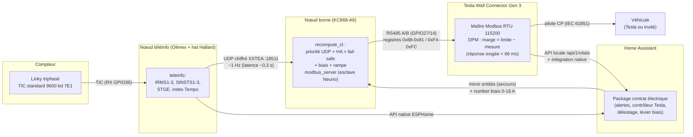

# Tesla LoadPilot - matériel (BOM) et architecture

> Généricisé - les IP/identifiants réels sont remplacés par des placeholders.

## 1. Nomenclature

| # | Matériel | Rôle | Détails / lien |
|---|---|---|---|
| 1 | **Compteur Linky triphasé** (contrat Tempo 15 kVA dans l'installation de référence) | Source de mesure : téléinfo TIC **mode standard**, 9600 bd, 7E1, trames ~1 Hz (SINSTS >400 octets en Tempo) | Sortie I1/I2 du compteur. Limite surveillée PAR PHASE : contrat ÷ 3 (5 000 VA/phase ≈ 21,7 A à 15 kVA) |
| 2 | **Nœud téléinfo : Olimex ESP32-POE** (modèle confirmé sur le site pilote) | Décode la TIC, publie vers HA (API native) **et** vers le nœud borne (UDP direct) | https://www.olimex.com/Products/IoT/ESP32/ESP32-POE/open-source-hardware - Ethernet LAN8720 : MDC GPIO23, MDIO GPIO18, CLK `GPIO17_OUT`, `phy_addr 0`. **Réconciliation config** (voir `20_FIRMWARE.md` §1.2) : la config de PRODUCTION (`board: esp32dev`, sans `power_pin`) fonctionne en Ethernet sur notre exemplaire - le brochage LAN8720 correspond bien à l'ESP32-POE ; mais la config de RÉFÉRENCE Olimex/ESPHome pour cette carte inclut `power_pin: GPIO12` (le GPIO qui alimente le PHY). La version publiée l'ajoute : sans lui le PHY dépend de l'état par défaut de GPIO12 et l'Ethernet peut ne pas revenir sur certains exemplaires/révisions après un soft-reset |
| 3 | **Hat téléinfo Hallard « WeMos TeleInfo »** | Adaptation du signal TIC vers l'UART de l'ESP32 (opto-isolation) | https://www.tindie.com/products/hallard/wemos-teleinfo/ - monté sur le port UART, **RX GPIO36**, 9600 bd 7E1, mode standard (relevé sur le site pilote) |
| 4 | **Kincony KC868-A6** (ESP32) | Nœud borne : émule le compteur Neurio en **esclave Modbus RTU** sur le RS485 du TWC | Transceiver RS485 **MAX13487E à direction automatique** (aucun DE/RE à piloter), TX **GPIO27** / RX **GPIO14**. Doc : https://devices.esphome.io/devices/kincony-kc868-a6/ , https://www.kincony.com/forum/showthread.php?tid=1962 . Sur le site pilote ce nœud est mutualisé avec d'autres fonctions domotiques - seule l'UART RS485 libre est utilisée par le TWC |
| 4bis | **Kincony ESP32-S3 Core Board** (alternative, NON validée) | Alternative économique pour le nœud borne | Module **ESP32-S3-WROOM-1U** ; la page constructeur annonce un bus RS485 et un port Ethernet filaire : https://www.kincony.com/kincony-esp32-s3-core-board.html . Board pack d'ébauche dans le dépôt (`esphome/packages/boards/esp32-s3-core.yaml`, `board: esp32-s3-devkitc-1`) : il compile, mais n'a **jamais été raccordé à une borne** - rejouer la QA minimale de `20_FIRMWARE.md` §2.9 avant tout usage réel. Un devkit ESP32-S3 nu (sans RS485) demande un transceiver externe type MAX485/MAX13487 |
| 4ter | **Alternative : Waveshare ESP32-S3-RS485-CAN** | RS485 isolé direction automatique, isolations numérique et alimentation, protections TVS/surtension/ESD, bornier 7-36 V, ESP32-S3R8. La plus robuste des alternatives sur le papier ; non validée sur banc | https://www.waveshare.com/esp32-s3-rs485-can.htm |
| 4quater | **Alternative : ESP32-POE + MOD-RS485-ISO (UEXT)** | Uniformité de flotte (même carte que le nœud compteur, PoE). ADM3483 half-duplex SANS direction automatique : piloter DE//RE ensemble via `flow_control_pin` ESPHome ; préférer la variante isolée (16,95 EUR). Théorique, non validé | https://www.olimex.com/Products/Modules/Interface/MOD-RS485/open-source-hardware |
| 5 | **Tesla Wall Connector Gen 3** (firmware ≥ 26.18) | La borne. Entrée « Home Load Management » = bus RS485 interne, la borne est **maître Modbus et polle** le compteur | Bornier **RS485 2 points derrière la façade** (près du 230 V → **disjoncteur de la borne COUPÉ** avant d'ouvrir). Câblage A/B + GND, CAT5e. **Polarité à inverser si muet** (octets reçus mais 0 trame valide = A/B permutés - vécu). Modbus RTU **115200 8N1** |
| 6 | Câble CAT5e (une paire + masse) | Liaison KC868 ↔ TWC | **Terminaison 120 Ω : non requise sur liaison courte** - VALIDÉ en production sans aucune résistance (115 200 bd, poll ~190 ms, zéro tx_blocked/trame rejetée sur des jours de fonctionnement). Ajouter 120 Ω à chaque extrémité si liaison longue (> quelques mètres) ou si erreurs de trame observées |

Cette BOM décrit l'installation de référence (France, Linky, triphasé). Les
lignes 1-3 forment le « fournisseur de mesure » et sont REMPLAÇABLES par
tout provider respectant le contrat UDP - équivalents par pays (port P1,
tête SML, pinces CT Shelly Pro 3EM / ATM90E32 = aussi l'étage sub-seconde)
et critère d'éligibilité en cadence : voir `15_FOURNISSEURS_MESURE.md`.

## 2. Câblage RS485 vers le TWC Gen 3

> **Illustrations - politique du dépôt** : ne JAMAIS reproduire un visuel de
> la documentation Tesla (images sous copyright, et le projet utilise déjà
> la marque dans son nom). On LIE la documentation officielle d'installation
> du Wall Connector Gen 3 - https://www.tesla.com/support/charging/wall-connector
> - et on illustre le raccordement avec NOS PROPRES schémas originaux
> (ci-dessous). Photos personnelles de l'installation bienvenues plus tard.

```
  Tesla Wall Connector Gen 3                            Nœud borne Kincony
  (façade déposée - DISJONCTEUR DE LA BORNE COUPÉ)      (KC868-A6, réf. testée)

  ┌───────────────────────────────┐                     ┌───────────────────────┐
  │   bornier RS485 « 2 points »  │      CAT5e          │  bornier RS485        │
  │   (interne, près du 230 V !)  │   (1 paire + masse) │  transceiver MAX13487E│
  │                               │                     │  (direction auto)     │
  │   fil ROUGE  (A+) ────────────┼──── paire torsadée ─┼── A                   │
  │   fil BLANC  (B−) ────────────┼──── (même paire) ───┼── B                   │
  │   GND ────────────────────────┼──── masse ──────────┼── GND                 │
  └───────────────────────────────┘                     └───────────────────────┘

  Muet (octets RX mais 0 trame valide) ?  →  permuter A et B (polarité).
  Liaison courte : pas de terminaison (validé) ; > quelques mètres : 120 Ω
  à chaque extrémité si erreurs de trame.
```

- borne **A** (KC868-A6) → fil **ROUGE** du bornier RS485 interne du TWC (A+)
- borne **B** (KC868-A6) → fil **BLANC** (B−)
- **GND commun** entre la KC868-A6 et le TWC
- bus point à point ; **terminaison 120 Ω non requise sur liaison courte**
  (validé en production sans) - en prévoir une à chaque extrémité si la
  liaison dépasse quelques mètres ou si des erreurs de trame apparaissent ;
- diagnostic : le compteur d'octets/trames du firmware - des octets arrivent
  mais aucune trame Modbus valide n'est décodée → polarité (permuter A/B) ;
  trames valides mais erreurs sporadiques → soigner la paire/terminaison.

## 3. Architecture



Deux chemins de mesure vers la borne, par ordre de priorité dans le
firmware du nœud borne :
1. **UDP direct** nœud téléinfo → nœud borne (packet_transport chiffré,
   ~1,1 s bout en bout, médiane mesurée) ;
2. **miroir Home Assistant** (entités télé-relevées, ~3 s, secours) ;
3. **fail-safe** : aucune source saine → le firmware publie une consommation
   = disjoncteur de branchement → marge nulle → charge bloquée (comportement
   d'un vrai compteur en panne).

## 4. Adresses réseau (placeholders)

| Élément | Placeholder |
|---|---|
| Nœud téléinfo (Ethernet) | `<IP_NOEUD_TELEINFO>` |
| Nœud borne (WiFi) | `<IP_NOEUD_BORNE>` |
| Borne TWC (API locale) | `<IP_BORNE>` |
| Home Assistant | `<IP_HA>:8123` |
| Port UDP packet_transport | 18511 (défaut ESPHome) |

Note WiFi : le nœud borne est en WiFi → si le contrôleur réseau bloque le
broadcast LAN→WLAN, passer l'UDP en **unicast** vers `<IP_NOEUD_BORNE>`
(réservation DHCP), une seule adresse à la fois (le rolling code rejette
les doublons broadcast+unicast).
